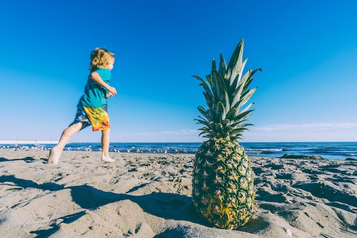

# Image to Ascii
Converts an image into ascii characters and outputs it to the command line 

**Original**


**VScode terminal**


**Windows PowerShell**


## Usage
- Clone repository to desired location
- Place an image named `test.jpg` into the `images` folder
- Navigate into the `src` folder
- Compile and run with the commands below

```
javac -cp ".;../lib/thumbnailator-0.4.8.jar" ImageToAscii.java
java -cp ".;../lib/thumbnailator-0.4.8.jar" ImageToAscii
```
- Images that are too wide may overflow, in that case choose a thinner image

## Dependencies
- Thumbnailator - An easy way to resize images before processing them

## How it works
1. Load and scales image down (we don't need all the pixels)
2. Read RGB values for each pixel and converts it to a linear value
4. Get luminance from rgb while accounting for human perception
5. Get human perceived brightness from luminance
6. Get ascii character by mapping brightness to character density
7. Print ascii characters!

## Todo
- Accept different image formats
- Automatically scale output image so that it fits most console outputs
- Choose different ascii character sets
- Invert output
- Add color 
